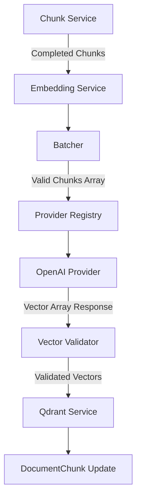

# Embedding Architecture

## Overview
The architecture is structured via dependency injection and abstraction registries to strictly separate orchestrator logic, upstream API interaction, payload packaging, and database persistence. 

## Components

### Provider abstraction
`BaseEmbeddingProvider` dictates that any embedding system must expose asynchronous `embed_batch` and `health` methods while abstracting underlying API nuances and returning consistent internal `BatchEmbeddingResponse` schemas.

### EmbeddingService
The top-level orchestrator. Responsible for identifying pending or un-embedded database chunks, passing them to the Batcher, forwarding grouped DTOs to the Registry Provider, assembling Qdrant Payloads, writing them to the `QdrantService`, and ultimately marking database states (including duration, tokens, checksums) appropriately. 

### Registry
`EmbeddingProviderRegistry` dynamically resolves the configured active provider based on environmental keys and registers the underlying implementation without the `EmbeddingService` requiring direct imports.

### Batcher
`Batcher` separates the input arrays into safely bounded subsets using `batch_size` settings. Includes defensive pre-validation (rejects empty chunks, duplicate inputs, invalid character arrays, or massive text fields) before network usage.

### OpenAI provider
Implements `AsyncOpenAI` utilizing `text-embedding-3-small`. Decorated with `tenacity` retry logic scaling organically for `429` (Rate limits) and `50x` (Provider downtimes), avoiding catastrophic pipeline failure. Converts internal payload metrics directly to accurate token and cost statistics.

### Qdrant service
Handles idempotent setup of `reviewguard_documents` Collections. On initialization, confirms dimensionality requirements (e.g. 1536) and distance specifications (Cosine) explicitly. Upserts data with heavily indexed UUID bindings.

### Database interaction
Chunk statuses advance sequentially from `PENDING` -> `PROCESSING` -> `EMBEDDED` / `FAILED`. Checksums operate defensively against re-embedding unaltered text streams during re-runs.

## Architecture diagram

