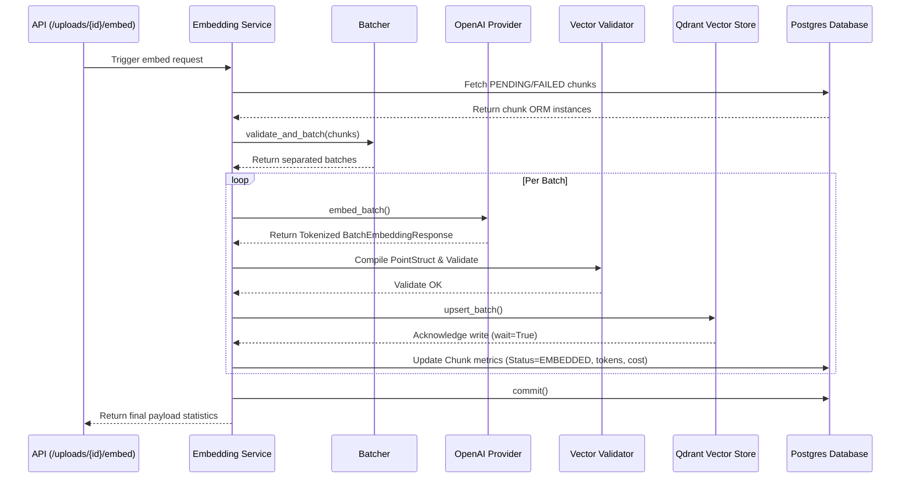

# Embedding Sequence

## Sequence Diagram

```mermaid
sequenceDiagram
    participant API as API (/uploads/{id}/embed)
    participant ES as Embedding Service
    participant B as Batcher
    participant O as OpenAI Provider
    participant V as Vector Validator
    participant Q as Qdrant Vector Store
    participant DB as Postgres Database

    API->>ES: Trigger embed request
    ES->>DB: Fetch PENDING/FAILED chunks
    DB-->>ES: Return chunk ORM instances
    ES->>B: validate_and_batch(chunks)
    B-->>ES: Return separated batches
    
    loop Per Batch
        ES->>O: embed_batch()
        O-->>ES: Return Tokenized BatchEmbeddingResponse
        ES->>V: Compile PointStruct & Validate
        V-->>ES: Validate OK
        ES->>Q: upsert_batch()
        Q-->>ES: Acknowledge write (wait=True)
        ES->>DB: Update Chunk metrics (Status=EMBEDDED, tokens, cost)
    end
    
    ES->>DB: commit()
    ES-->>API: Return final payload statistics
```
