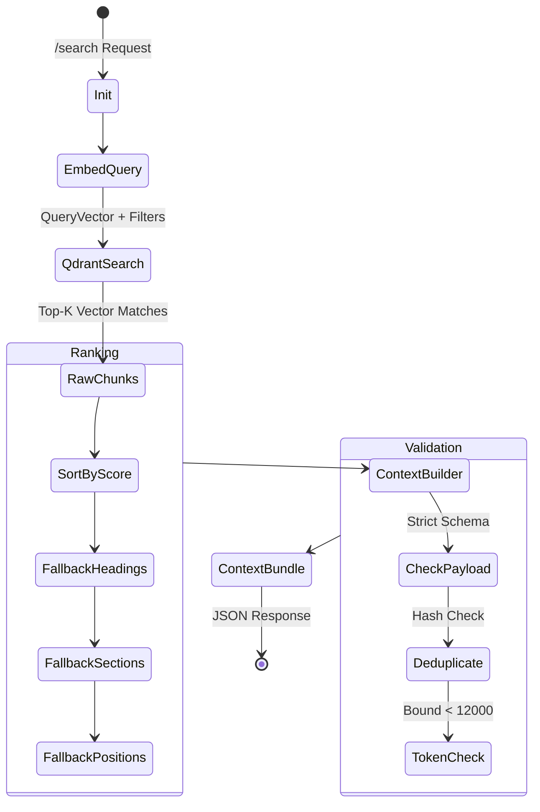

# Retrieval Flow Architecture

## State Transition Diagram

```mermaid
stateDiagram-v2
    [*] --> Init: /search Request
    Init --> EmbedQuery
    EmbedQuery --> QdrantSearch: QueryVector + Filters
    QdrantSearch --> RawChunks: Top-K Vector Matches
    
    state Ranking {
        RawChunks --> SortByScore
        SortByScore --> FallbackHeadings
        FallbackHeadings --> FallbackSections
        FallbackSections --> FallbackPositions
    }
    
    Ranking --> ContextBuilder
    
    state Validation {
        ContextBuilder --> CheckPayload: Strict Schema
        CheckPayload --> Deduplicate: Hash Check
        Deduplicate --> TokenCheck: Bound < 12000
    }
    
    Validation --> ContextBundle
    ContextBundle --> [*]: JSON Response
```
