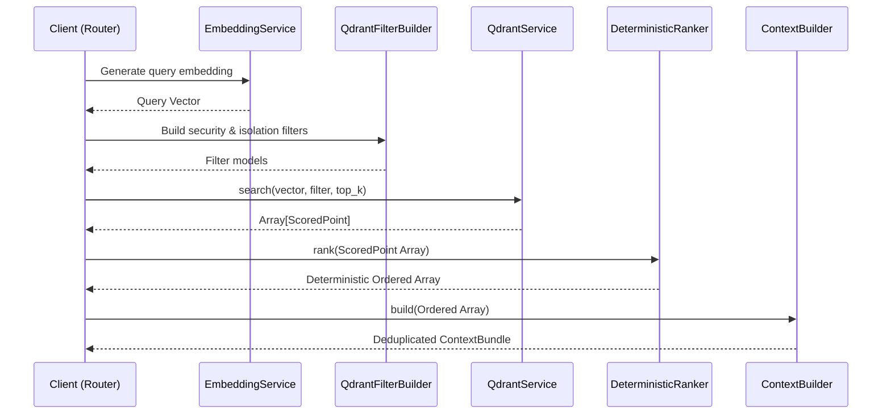

# Retrieval Sequence

## Sequence Diagram

```mermaid
sequenceDiagram
    participant C as Client (Router)
    participant ES as EmbeddingService
    participant F as QdrantFilterBuilder
    participant QS as QdrantService
    participant DR as DeterministicRanker
    participant CB as ContextBuilder

    C->>ES: Generate query embedding
    ES-->>C: Query Vector
    C->>F: Build security & isolation filters
    F-->>C: Filter models
    C->>QS: search(vector, filter, top_k)
    QS-->>C: Array[ScoredPoint]
    C->>DR: rank(ScoredPoint Array)
    DR-->>C: Deterministic Ordered Array
    C->>CB: build(Ordered Array)
    CB-->>C: Deduplicated ContextBundle
```
